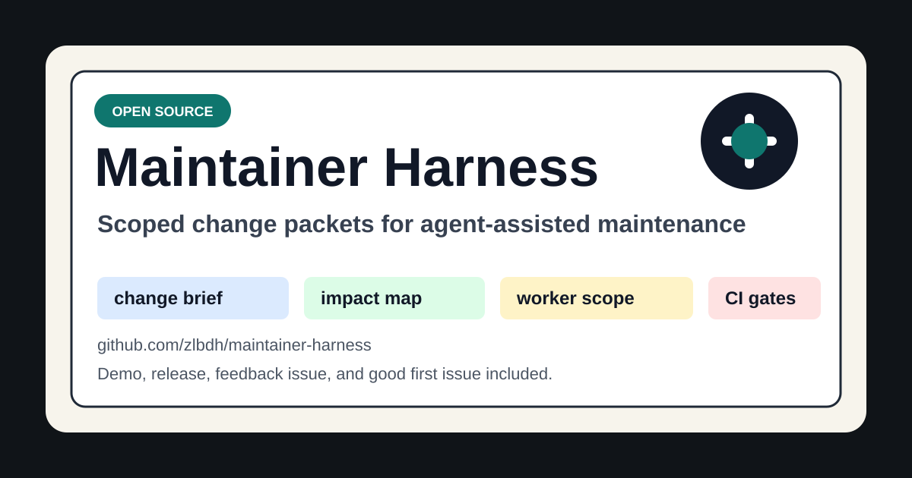

# Maintainer Harness

[](https://github.com/zlbdh/maintainer-harness/actions/workflows/harness-validation.yml)
[](LICENSE)
[](docs/security/security-review-checklist.md)

Maintainer Harness is a lightweight control plane for open source maintainers who want Codex and other agents to work from scoped packets instead of vague chat.

**Status:** early public-ready project. The current repository uses synthetic sample repositories so maintainers can inspect the workflow before connecting real projects.

**Project site:** https://zlbdh.github.io/maintainer-harness/

**External review path:** https://zlbdh.github.io/maintainer-harness/external-review.html

**Public review request:** https://github.com/zlbdh/maintainer-harness/blob/main/docs/review-request.md

**中文朋友实测教程:** https://github.com/zlbdh/maintainer-harness/blob/main/docs/friend-review-guide-zh.md

**中文一页转发教程:** https://github.com/zlbdh/maintainer-harness/blob/main/docs/friend-review-onepager-zh.md

**中文发送前检查清单:** https://github.com/zlbdh/maintainer-harness/blob/main/docs/friend-review-send-checklist-zh.md

**中文反馈回收说明:** https://github.com/zlbdh/maintainer-harness/blob/main/docs/friend-feedback-recovery-zh.md

**First-run 中文排障:** https://github.com/zlbdh/maintainer-harness/blob/main/docs/first-run-troubleshooting-zh.md

**First-run troubleshooting:** https://github.com/zlbdh/maintainer-harness/blob/main/docs/first-run-troubleshooting.md

**Codespaces first-run:** https://github.com/zlbdh/maintainer-harness/blob/main/docs/codespaces-first-run.md

**Reviewer kit:** if you have five minutes, use
`docs/maintainer-review-kit.md` to inspect the workflow shape, run the clean
demo, or leave public feedback.

**Reviewability example:** `docs/worker-output-reviewability.md` compares vague
worker output with evidence a maintainer can actually review.

**Outside reviewer actions:**

| Time | Best action | Public link |
| --- | --- | --- |
| 3 min | Say what evidence is missing before accepting agent output. | [Issue #5](https://github.com/zlbdh/maintainer-harness/issues/5#issuecomment-new) |
| 5 min | Run the clean demo and post first-run friction. | [Issue #6](https://github.com/zlbdh/maintainer-harness/issues/6#issuecomment-new) |
| After inspection | Use the copy-ready comment templates if they match what you actually saw. | [External review templates](https://zlbdh.github.io/maintainer-harness/external-review.html#templates) |
| After feedback | Track any concrete follow-up as a public issue, commit, or release note. | [Issue #7](https://github.com/zlbdh/maintainer-harness/issues/7) |

**Fastest first-run route:**

```powershell
git clone https://github.com/zlbdh/maintainer-harness.git
cd maintainer-harness
.\scripts\checks\run-review-demo.ps1
```

On macOS or Linux with PowerShell 7:

```bash
git clone https://github.com/zlbdh/maintainer-harness.git
cd maintainer-harness
pwsh ./scripts/checks/run-review-demo.ps1
```

If you do not want to set up local Git or PowerShell first, open the cloud
first-run path:
https://codespaces.new/zlbdh/maintainer-harness?quickstart=1

Then paste the generated `Copy This Comment Into Issue #6` block into
issue [#6](https://github.com/zlbdh/maintainer-harness/issues/6#issuecomment-new).
If you want the sanitized issue #6 comment block copied after the report is
generated, run `.\scripts\checks\run-review-demo.ps1 -CopyCommentToClipboard`
or `pwsh ./scripts/checks/run-review-demo.ps1 -CopyCommentToClipboard`.
For Chinese reviewers, use `.\scripts\checks\run-review-demo.ps1 -CommentLanguage zh -CopyCommentToClipboard -OpenCommentTarget`
or `pwsh ./scripts/checks/run-review-demo.ps1 -CommentLanguage zh -CopyCommentToClipboard -OpenCommentTarget`
to copy the Chinese issue #6 block and open the comment target.
Use `-OpenCommentTarget` if you also want the issue #6 comment target opened
after the report is written. The script never posts a comment for you.
If the command fails, use
`docs/first-run-troubleshooting.md` or
`docs/first-run-troubleshooting-zh.md` before posting the failure details.
If you only inspected the docs or worker-output example, comment on issue
[#5](https://github.com/zlbdh/maintainer-harness/issues/5#issuecomment-new)
with one concrete evidence gap instead.

**Share or star:** if the demo is useful, share the project site or star the
repository so other maintainers can find it. Feedback is more valuable than a
vanity metric; the best starting points are issue
[#5](https://github.com/zlbdh/maintainer-harness/issues/5#issuecomment-new) for reviewability
feedback and issue [#6](https://github.com/zlbdh/maintainer-harness/issues/6#issuecomment-new)
for first-run friction.

It does not replace your product repositories. It keeps the operational layer around them auditable:

- change intake
- cross-repository impact analysis
- task cards and write scopes
- worker dispatch packets
- local validation reports
- release notes and postmortems
- reusable maintainer skills

The project is intentionally repository-agnostic. The default configuration uses sample repositories under `repos/repos.yaml`; replace those entries with your own repositories before running real maintenance workflows.



## Try It In 90 Seconds

The default sample change is synthetic and safe to run in a clean checkout on
Windows PowerShell or PowerShell 7:

```powershell
.\scripts\checks\run-review-demo.ps1
```

On macOS or Linux with PowerShell 7:

```bash
pwsh ./scripts/checks/run-review-demo.ps1
```

Cloud first-run path:
https://codespaces.new/zlbdh/maintainer-harness?quickstart=1

That one command runs the public demo checks and writes a paste-ready first-run
feedback draft plus a machine-readable JSON summary under `reports/first-run/`.
The JSON file is ignored local evidence for reviewers and follow-up triage; it
does not count unless the reviewer posts a public issue comment or public URL.
Use `-CopyCommentToClipboard` when you want the generated issue #6 comment
block copied for easier review and paste.
Use `-OpenCommentTarget` when you want the issue #6 comment target opened in
your browser after the report is written.
Use `-CommentLanguage zh -CopyCommentToClipboard -OpenCommentTarget` when a
Chinese-speaking reviewer wants the Chinese issue #6 block copied and the
comment target opened after the report is written.
To run the same checks manually:

```powershell
.\scripts\checks\validate-repos.ps1
.\scripts\bootstrap\verify-workspace.ps1
.\scripts\checks\validate-change.ps1 -Path examples\sample-change
.\scripts\checks\validate-change.ps1 -Path examples\issue-to-review
.\scripts\checks\validate-change.ps1 -Path examples\release-workflow
.\scripts\checks\check-public-ready.ps1
.\scripts\checks\check-security-posture.ps1
```

That flow checks the harness, validates complete sample change packets, runs
the default high-confidence secret scan, and confirms the public security
posture. See `docs/demo.md` for a short transcript and the project site for a
shareable overview.

If you want to report first-run friction, generate a paste-ready issue draft:

```powershell
.\scripts\checks\write-first-run-report.ps1
```

Add `-CopyCommentToClipboard` to copy the generated issue #6 comment block
after the report is written.
Add `-OpenCommentTarget` to open the issue #6 comment target without posting
anything automatically.

If you want a local packet for asking maintainers to review the project:

```powershell
.\scripts\checks\write-review-request-packet.ps1
```

For a public copy that can be sent without generating a local file, use
`docs/review-request.md`.

## Why This Exists

Agent-assisted maintenance often fails for ordinary reasons:

- the task starts before scope is clear
- multiple workers touch the same files
- validation is described but not actually run
- release notes lose the evidence trail
- project knowledge stays trapped in chat history

This harness turns those risks into files, checks, and repeatable commands.

## Who This Is For

- maintainers coordinating fixes across multiple repositories
- open source projects trying agent-assisted PR review without losing auditability
- teams that want workers to receive explicit write scopes and validation commands
- contributors who need clear evidence before a release decision

It is not a hosted product, a replacement for project-specific CI, or a way to bypass human review.

## Core Concepts

- `change-id`: one durable identifier for each maintenance change
- `brief.md`: what changed and why
- `impact.yaml`: affected repositories, interfaces, configs, and dependency order
- `execution.yaml`: owners, branches, worktrees, lock state, and result locations
- `tasks/<repo>.md`: one bounded task card per repository
- `verification/result.md`: final evidence and acceptance result
- `.agent/skills/`: local recipes for common maintainer workflows

## Directory Layout

```text
.
├── AGENTS.md
├── .agent/
│   └── skills/
├── repos/
│   └── repos.yaml
├── config/
│   └── agent-registry.yaml
├── docs/
├── standards/
├── templates/
├── changes/
├── evals/
├── reports/
├── release/
├── mcp/
└── scripts/
```

## Quick Start

1. Edit `repos/repos.yaml` and replace the sample repositories with your project repositories.

2. Check the harness structure and repository metadata:

```powershell
.\scripts\checks\validate-repos.ps1
.\scripts\bootstrap\verify-workspace.ps1
```

3. Dry-run repository clone or sync:

```powershell
.\scripts\bootstrap\clone-repos.ps1 -DryRun
.\scripts\bootstrap\sync-repos.ps1 -DryRun
```

4. Discover local contracts and run baseline checks:

```powershell
.\scripts\checks\discover-contracts.ps1
.\scripts\checks\run-local-baseline.ps1 -SkipCommandExecution
```

5. Create a change packet:

```powershell
.\scripts\bootstrap\init-change.ps1 -ChangeId CHG-2026-0001-sample-change -Title "Sample maintainer workflow"
.\scripts\checks\validate-change.ps1 -ChangeId CHG-2026-0001-sample-change
```

6. Prepare worker packets:

```powershell
.\scripts\orchestrator\dispatch-change.ps1 -ChangeId CHG-2026-0001-sample-change -DryRun
```

See `examples/sample-change/` for a synthetic docs-validation packet, `examples/issue-to-review/` for an issue-to-change packet shaped for pull request review, and `examples/release-workflow/` for release evidence and skipped-check handling.

## Validation

The default validation workflow runs on Windows PowerShell and is also wired into GitHub Actions:

```powershell
.\scripts\checks\validate-repos.ps1
.\scripts\bootstrap\verify-workspace.ps1
.\scripts\checks\discover-contracts.ps1 -NoReport -Quiet -PassThru | ConvertTo-Json -Depth 5
.\scripts\checks\run-local-baseline.ps1 -SkipCommandExecution -Quiet -PassThru | ConvertTo-Json -Depth 5
.\scripts\checks\check-public-ready.ps1
.\scripts\checks\check-security-posture.ps1
```

GitHub Actions runs the public validation gate on Windows, Ubuntu, and macOS. In a fresh checkout, sample repositories are expected to report warning-level `missing-local-env` until you replace or clone them. See `docs/validation.md` and `docs/cross-platform-validation.md`.

## Configuration Files

- `repos/repos.yaml`: repository metadata and validation commands
- `config/agent-registry.yaml`: maintainer roles and allowed write scopes
- `templates/`: change, task, verification, release, and postmortem templates
- `standards/`: global and repository-specific guardrails
- `mcp/`: read-only MCP blueprints for safe external context

## Open Source Project Files

- `CONTRIBUTING.md`: contribution workflow and local validation
- `SECURITY.md`: vulnerability reporting and security boundaries
- `CODE_OF_CONDUCT.md`: community behavior expectations
- `SUPPORT.md`: support channels and issue guidance
- `MAINTAINERS.md` and `.github/CODEOWNERS`: ownership and review routing
- `.github/repository-settings.yml`: suggested public GitHub description, topics, and branch protection
- `.github/`: issue and pull request templates
- `docs/codex-for-oss-application.md`: application summary for OpenAI Codex for OSS
- `docs/codex-for-oss-evidence.md`: evidence matrix for Codex for OSS program fit
- `docs/codex-for-oss-submission-readiness.md`: public submission readiness checklist for the application evidence package
- `docs/codex-for-oss-reviewer-brief.md`: one-page reviewer brief for the full-support request
- `docs/codex-for-oss-90-scorecard.md`: hard gates and script-backed scorecard for the 90% readiness target
- `docs/dogfooding-plan.md`: 30-day public dogfooding plan for API-credit-backed maintainer workflows
- `docs/dogfooding-runs/`: public dogfooding run notes and validation evidence
- `docs/external-validation-sprint.md`: 24-48 hour plan for collecting honest maintainer feedback signals
- `docs/maintainer-review-kit.md`: five-minute outside maintainer feedback path
- `docs/friend-review-send-checklist-zh.md`: Chinese pre-send checklist for one-to-one real friend review outreach without star requests or self-owned accounts
- `docs/friend-feedback-recovery-zh.md`: Chinese guidance for turning real private/public friend feedback into safe public evidence without counting private messages or self-owned accounts
- `docs/worker-output-reviewability.md`: good/bad worker output evidence example for maintainer review
- `docs/index.html`, `docs/external-review.html`, `docs/site.css`, and `docs/.nojekyll`: GitHub Pages project site and external reviewer path
- `docs/demo.md`: short demo transcript for the synthetic maintainer workflow
- `docs/cross-platform-validation.md`: Windows, Ubuntu, and macOS validation coverage and current boundaries
- `docs/launch-kit.md`: policy-safe launch copy and outreach plan for real open source discovery
- `docs/share.md`: compact share page with demo commands and canonical links
- `docs/launch-log.md`: public launch action and metrics tracking
- `docs/assets/social-preview.svg`: social preview card for launch posts
- `docs/security/`: threat model, Codex Security project overview, review scope, first review pass, redaction guidance, and security review checklist
- `docs/github-publication.md`: safe publication steps for GitHub
- `examples/issue-to-review/`: synthetic GitHub issue intake through pull request review evidence
- `examples/release-workflow/`: synthetic release note, rollback, skipped-check, and postmortem-ready evidence
- `CHANGELOG.md` and `ROADMAP.md`: project status and planned maintainer workflows
- `.github/workflows/harness-validation.yml`: public CI entry point
- `scripts/bootstrap/prepare-publication.ps1`: dry-run/apply helper for the final public commit
- `scripts/checks/write-application-audit.ps1`: ignored pre-application audit report generator
- `scripts/checks/run-review-demo.ps1`: one-command external review demo and first-run report handoff
- `scripts/checks/write-first-run-report.ps1`: ignored first-run report generator for outside demo feedback
- `scripts/checks/add-external-feedback-evidence.ps1`: guarded append helper for verified public feedback URLs
- `scripts/checks/write-review-request-packet.ps1`: ignored outreach packet generator for honest maintainer review requests
- `scripts/checks/write-public-discovery-plan.ps1`: ignored manual public discovery plan generator for feedback-first posts without votes, stars, automatic posting, or evidence writes
- `scripts/checks/write-reviewer-followup-tracker.ps1`: ignored manual follow-up tracker for real reviewer statuses, public URL capture, and no-private-feedback counting rules
- `scripts/checks/check-reviewer-comment-draft.ps1`: local-only preflight for issue comment drafts before public posting, checking for secrets, local paths, internal endpoints, and raw sensitive context without posting or counting evidence
- `scripts/checks/check-security-posture.ps1`: CI-friendly security posture gate for agent scopes, MCP safety, and ignored artifacts
- `.github/workflows/codex-readiness-monitor.yml`: scheduled and manual Codex for OSS readiness monitor

## Public Hygiene

This repository is meant to be public. Do not commit:

- product source checkouts under `repos/`
- generated worktrees under `worktrees/`
- local validation reports with sensitive paths
- credentials, tokens, private endpoints, customer data, or production logs
- unredacted validation evidence copied from ignored report paths

The included `.gitignore` keeps the default repository safe for public use, but maintainers should still review `git status --ignored` before publishing.

## License

MIT License. See `LICENSE`.
