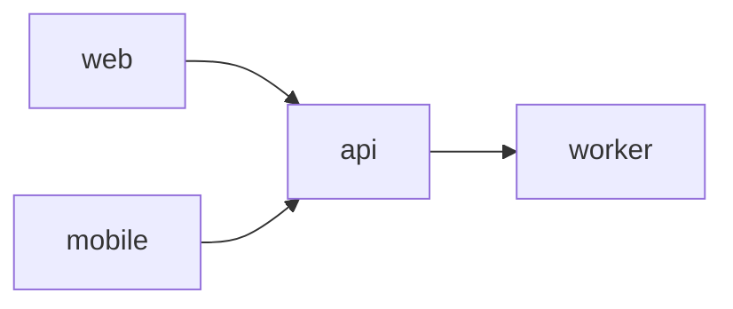

# Dependency Map

Use this file to describe repository dependencies.

Generic example:

For each edge, record:

- dependency type
- contract source
- validation command
- failure mode
- owner

Keep the map current with `repos/repos.yaml` and `impact.yaml`.
